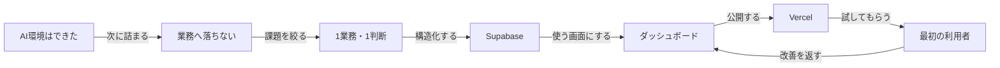

# Dialog Map: 自社ダッシュボード開発AI合宿

## Focus Question

前回の「AI環境を作る合宿」の次に、参加者が自社で使われるダッシュボードを持ち帰るには、どの壁をどの順番で越えるべきか？

## 本筋

- 到達点: 社員が翌週から試せる、自社データ入りの公開ダッシュボードを持ち帰る。
- 非ゴール: 1泊2日で全社基幹システムを完成させること。
- 受け手基準: 非エンジニアの経営者が、自社課題1件を実利用可能な最小形へ変えられること。

## Map

## Verified

- 前回募集では、環境構築で止まること、自社業務へフィットしないこと、情報に手が追いつかないことを参加者の壁としていた。参照: 前回Notion募集ページ。
- 前回の完了条件は、AI環境を自分仕様にし、GitHub等と連携して持ち帰ることだった。参照: 前回Notion募集ページ。
- SupabaseはPostgresデータベースとAuthを統合し、RLSによる行単位のアクセス制御に利用できる。参照: https://supabase.com/docs/guides/auth
- VercelはGit連携により、pushやPull RequestからPreview/Productionへデプロイできる。参照: https://vercel.com/docs/git

## Inferred

- 前回参加後の次の壁は、AI操作スキルよりも「題材の絞り込み」「実データ接続」「権限」「公開」「現場定着」に移る。
- 合宿価値はツール習得ではなく、1人の実利用者へURLを渡し、翌週から試せる状態に置くことで最大化する。
- 全員共通テンプレートより、共通基盤と個別の1業務テーマを組み合わせた方が、持ち帰り価値が高い。

## Decisions

- 2026-08-02 / Codex草案: 次回テーマを「自社オリジナルダッシュボード開発」として募集文を作る。
- 2026-08-02 / Codex草案: 完了条件を「社員に渡せるURL」「実データまたは安全なサンプルデータ」「翌週の試用者」に置く。
- 2026-08-02 / Codex草案: SupabaseとVercelは目的ではなく、データ保存・認証・公開を越えるための基盤として扱う。

## Unknowns

- 開催日、会場、定員、参加費、申込方法。確認者: 和島祐生。
- 対象者を前回参加者に限定するか、未参加者も含めるか。確認者: 和島祐生。
- 参加者が持ち込めるデータの機密区分と、当日扱ってよい範囲。確認方法: 事前アンケート。
- 合宿後の伴走期間を付けるか。確認者: 和島祐生。

## Parking Lot

- 外部SaaSやスプレッドシートとの自動同期。
- AIによる要約、予測、アラートなどの高度機能。
- 独自ドメイン、課金、一般顧客向けSaaS化。
- 全社展開時の監査・バックアップ・本番運用設計。
