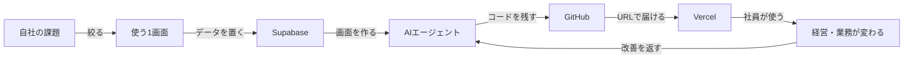

# ♨️【日程未定｜千葉・古民家】自社ダッシュボード開発 1泊2日AI合宿

#### 〜「AIで作ってみた」で終わらせず、自社の数字と業務が動く“本物の道具”を持ち帰る2日間〜

---

AIに頼めば、画面は作れる。

けれど今、多くの経営者がぶつかっているのは、その次の壁です。

- 見た目はできた。でも、実際のデータが入っていない
- Excelやスプレッドシートが散らばり、数字を集めるだけで時間が溶ける
- 毎週の会議で、古い数字を見ながら意思決定している
- AIに作らせたものの、ログイン・権限・保存・公開で止まった
- 作った本人しか使えず、社員の仕事に入っていかない
- 改修するたびに壊れそうで、結局いつもの手作業へ戻ってしまう

つまり、今の壁は「AIを使えるか」ではありません。

> **自社の課題を、データが入り、社員が使え、経営判断が変わる仕組みにできるか。**

次回のAI合宿では、この壁をぶっ壊します！！！！！！

Claude Code / CodexなどのAIエージェントに加え、**Supabase、Vercel、GitHub**を使い、参加者それぞれが自社専用のオリジナルダッシュボードを1泊2日で開発します。

テンプレートを眺めて終わる勉強会ではありません。

自社の実データと実業務を持ち込み、最後は**社員にURLを渡して使ってもらえる状態**まで、一緒に持っていく完全伴走型の合宿です。

---

## 🎯 この合宿が目指すゴール

> **自社の重要な数字と業務がひとつにつながった、ログインして使えるオリジナルダッシュボードを持ち帰る。**

合宿終了時点で、次の状態を目指します。

- 自社の課題を「誰が・何を見ると・何を判断できるか」まで整理できている
- 必要なデータ項目と入力方法が決まり、Supabaseに保存できる
- ログインと閲覧権限があり、社員ごとに安全に使い分けられる
- 自社らしい画面で、重要な数字・案件・進捗を確認できる
- Vercelで公開され、PCやスマホからURLで開ける
- GitHubにコードが残り、合宿後もAIと一緒に改善し続けられる
- 少なくとも1人の実利用者が、翌週から試せる状態になっている

完成度100%の基幹システムを2日で作ることが目的ではありません。

まずは、**経営や現場の詰まりをひとつ解消する“小さくても本当に動く道具”**を完成させます。

---

## 💥 今回ぶっ壊す「5つの壁」

### 壁1｜何を作ればいいか決められない

「ダッシュボードが欲しい」だけでは、AIも正解を作れません。

最初に、自社で時間が失われている場面、判断が遅れている場面、数字が見えず困っている場面を特定します。そのうえで、機能ではなく**変えたい意思決定と業務**から逆算します。

### 壁2｜デモ画面から先へ進めない

AIはきれいな画面をすぐ作れます。しかし、データが保存されなければ業務では使えません。

Supabaseを使い、顧客・案件・売上・タスク・KPIなど、自社に必要な情報を蓄積できるデータベースを作ります。

### 壁3｜ログイン・権限・公開で止まる

「自分のPCでは動く」から「社員が安全に使える」までには、大きな谷があります。

ログイン、閲覧範囲、環境変数、公開設定を一緒に越え、Vercel上で使えるURLにします。

### 壁4｜自分専用で、現場に定着しない

作ることより、使われることのほうが難しい。

誰が、いつ、何を入力し、何を見て、次にどう動くのかまで設計します。合宿中に利用シーンを確認し、余計な機能を削り、現場が触れる最小形にします。

### 壁5｜合宿後に育たない

外注したシステムは、少し変えたいだけでも時間と費用がかかります。

今回はコード、データ構造、AIへの指示書を自社側に残します。帰宅後も「この項目を追加して」「このグラフを変えて」とAIに頼み、自社で改善できる土台を作ります。

---

## 🧑‍💻 こんな方に来てほしい

- AIでHTMLやアプリを作ったが、実務投入の直前で止まっている方
- スプレッドシート、チャット、紙に情報が散らばっている方
- 売上、案件、採用、顧客対応などの状況をリアルタイムに近い形で見たい方
- 毎週の集計や報告資料づくりを減らしたい方
- パッケージ製品が自社業務に合わず、無理に運用を合わせている方
- エンジニア任せにせず、自社で業務システムを育てられる会社にしたい方
- 1泊2日で逃げずに、自社の課題をひとつ動く形まで持っていきたい方

プログラミング経験は必須ではありません。

必要なのは、**自社の何を変えたいかを持ち込み、実際に使えるところまでやり切る意思**です。

---

## 🛠 作れるものの例

参加者全員が同じものを作るのではなく、自社の課題に合わせて1テーマを選びます。

- 経営KPIダッシュボード
- 営業案件・見込み売上ダッシュボード
- 顧客対応・問い合わせ管理画面
- 採用候補者・選考進捗ダッシュボード
- 店舗別・拠点別の実績管理画面
- プロジェクト・タスク進捗画面
- 在庫・発注・納期の確認画面
- AIが要約・分類・提案まで行う業務コックピット

ただし、機能を盛るほど成功するわけではありません。

当日は「一番重要な判断を変える1画面」から着手し、時間が余れば広げます。

---

## 🗺 合宿でやること（カリキュラム草案）

### 1. 課題を絞る｜何のためのダッシュボードか

- 現在の業務と情報の流れを棚卸しする
- 誰の、どの判断を速く・正確にするか決める
- 合宿中に作る範囲と、今回は作らない範囲を決める
- 完成判定を「画面がある」ではなく「実際に使える」で定義する

### 2. データを設計する｜Supabase

- 必要なデータ項目と関係を整理する
- Supabaseに自社用のデータベースを作る
- 入力・更新・検索ができる状態にする
- ログインと利用者ごとの権限を設定する

### 3. 画面を作る｜AIエージェント

- 自社の用途に合ったUIをAIと一緒に作る
- 一覧、詳細、入力フォーム、グラフを実装する
- PC・スマホの両方で使える形に整える
- 実データを入れ、使いにくい箇所をその場で直す

### 4. 社内へ届ける｜GitHub × Vercel

- GitHubにコードを保存する
- Vercelと連携してWebへ公開する
- 公開前のプレビューで動作確認する
- 社員がアクセスできるURLを発行する

### 5. 使って育てる｜運用設計

- 誰が入力し、誰が確認するかを決める
- 翌週の試用者と最初の利用場面を決める
- 改善要望をAIへ渡す方法を残す
- 合宿後7日間の改善計画を作る

---

## 🔗 今回つながる仕組み

---

## 📦 持ち帰れるもの

- 自社専用ダッシュボードの公開URL
- 自社データを保存するSupabaseプロジェクト
- GitHub上のソースコード
- AIが継続改修するための指示書
- データ項目・権限・運用担当の設計
- 合宿後7日間の実利用・改善プラン

「勉強になった」で終わらず、**会社で動き始める資産**を持ち帰ります。

---

## 🧳 参加前に持ってきてほしいもの

- ノートPC・充電器
- 自社で見えるようにしたい数字や業務の候補
- サンプルデータ（個人情報・機密情報を除いたもの）
- 現在使っているExcelやスプレッドシートの項目例
- 合宿後に最初に試してくれる社員1名の候補

事前ヒアリングでテーマを仮決めします。機密性の高い実データをそのまま持ち込む必要はありません。まずは匿名化・ダミーデータで作り、利用可能なデータへの切り替え方まで整理します。

---

## 📋 開催概要

| 項目 | 内容 |
| --- | --- |
| 開催日 | 【未定】1泊2日 |
| 会場 | 【未定】千葉・古民家（ネット環境／サウナあり） |
| 定員 | 【未定】10名程度 |
| 対象 | AI部（ビジアスAIクラブ）所属の経営者 |
| 参加費 | 【未定】宿泊・食事込み |
| 持ち物 | ノートPC／充電器／着替え／洗面用具／題材となる業務・サンプルデータ |
| 事前準備 | GitHub・Supabase・Vercelのアカウント作成、AI開発環境の準備 |
| 申込方法 | 【未定】 |
| 申込締切 | 定員に達し次第終了 |
| 主催 | 和島祐生 / ビジアスAIクラブ |

---

## 🙋 この合宿でやらないこと

- 2日間で全社基幹システムを完成させること
- 要件が曖昧なまま、機能を大量に作ること
- 機密データを無理にクラウドへ移すこと
- 作って満足し、利用者と運用担当を決めずに終わること

大きな構想は歓迎です。ただし合宿では、その構想を動かし始める**最初の1業務・1画面・1利用者**に絞ります。

---

## 💬 最後に

AIで画面を作れる人は、これから一気に増えます。

でも、会社を変えるのは「画面を作った人」ではありません。

**自社の課題を見抜き、データと業務をつなぎ、社員が使うところまで持っていける人**です。

前回は、AIを自分の仕事へ入れるための土台を作りました。

次は、そのAIと一緒に、会社の中で本当に動くものを作ります。

1泊2日。自社の数字が見えない壁、データが散らばる壁、作ったものが使われない壁を、一緒にぶっ壊しましょう！！！！！！

帰るときには、説明資料ではなく、社員に渡せるURLを持って帰ってください。

お待ちしています。

**和島 祐生**

---

## 参考：使用予定サービス

- [Supabase 公式ドキュメント](https://supabase.com/docs) — データベース、認証、権限管理
- [Vercel 公式ドキュメント](https://vercel.com/docs) — プレビュー、本番公開、GitHub連携
- GitHub — ソースコードと変更履歴の管理
- Claude Code / Codex — 設計、実装、修正を進めるAIエージェント
